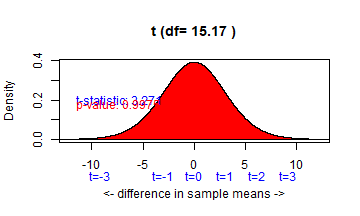
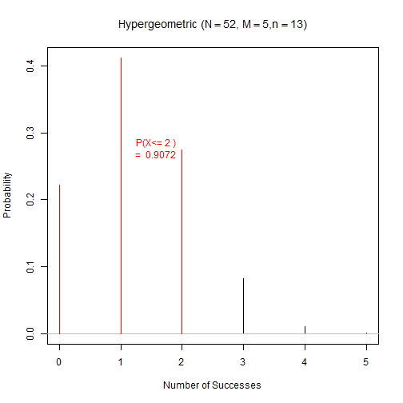
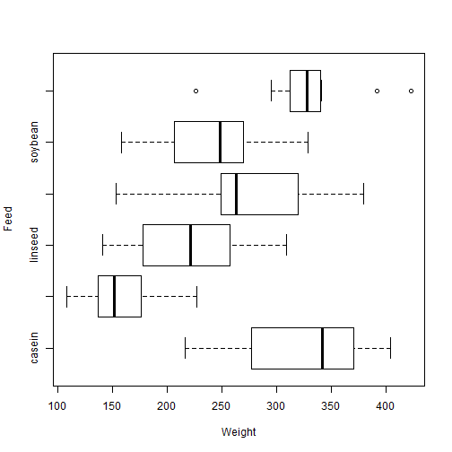
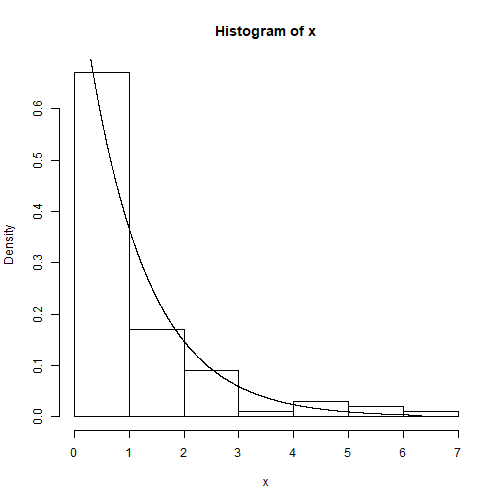
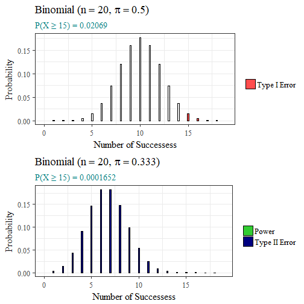

Building an ISCAM Package Using Best Programming Practices in R
========================================================
author: Noelle Pablo
date: June 7, 2018
autosize: true


Investigating Statistical Concepts, Applications, and Methods (ISCAM)
========================================================


- Introduces students to
fundamental concepts <br /> and various applications of statistics. 
- Used in 20 Academic Institutions
- Technological tools 
  - Applets
  - JMP Journal
  - R Workspace

ISCAM Functions
========================================================
type: prompt
## Seven Categories:
- Summary Statistics
- Data Visualization
- Hypothesis Testing
- Rejection Regions & Power
- Probability Distributions & Quantiles
- Normal Approximations
- Histograms with Overlaid Density Curves


Hypothesis Testing: iscamtwosamplet
========================================================
<center>

```r
iscamtwosamplet(97.25, 3.65, 8, 87.25, 9.60, 12, alternative = "less")
```

```

Two Sample t test

Group1: mean = 97.25, sd = 3.65,  sample size = 8
Group2: mean = 87.25, sd = 9.6,  sample size = 12
diff:10

Null hypothesis       : mu1-mu2 = 0 
Alternative hypothesis: mu1-mu2 < 0 
t-statistic: 3.271 
df: 15.17 
```



```
p-value: 0.9975 
```
</center>

Probability Distributions & Quantiles: iscamhyperprob
========================================================
Suppose we select 5 cards from an ordinary deck of playing cards. What is the probability of obtaining 2 or fewer hearts?
<center>

```r
iscamhyperprob(2, 52, 5, 13, lower.tail = TRUE)
```



```
Probability 2 and below = 0.9072329 
```

```
[1] 0.9072329
```
<center>

Normal Approximations: iscambinomnorm
========================================================
<center>

```r
iscambinomnorm(20, 30, 0.5, direction = "above")
```



```
 binomial: 0.04937 
 normal approx: 0.03394 
 normal approx with continuity: 0.05017 
```
</center>


R Workspace
========================================================

- 26 ISCAM Functions
- Easy to share
- Holds any user-defined objects
- Lack of function documentation

```r
load("C:/Users/noell/Desktop/ISCAM.RData")
```
<center>

</center>

R Packages
========================================================
type: prompt
- Bundles together code, data, documentation, and tests
- Easy to share with others
- 12,000+ packages in Comprehensive R Archive Network (CRAN)
- Make life easier

<center>

</center>

Documentation
========================================================
type: prompt
- One of the most important aspects of a package 
- How to use your package 
- What functions are supposed to do
  - Descriptions of arguments
  - Examples
- Vignette
  - Long-form documentation
  - Find function that you need
  
ISCAM Function Documentation
========================================================

```r
iscambinompower("?")
```

```
Error in iscambinompower("?"): iscambinompower(LOS, n, prob1, alternative, prob2) 
 This function determines the rejection region 
 corresponding to the level of significance and the first probability 
 and shows the second distribution shading its corresponding region. 
 alternative can be "less", "greater", or "two.sided".
```

Documentation
========================================================

  
Vignette
========================================================


Gender Gap in Creating R Packages
========================================================
- Underrepresentation of Women in R Community
- In 2016, 11% - 15% Package Authors "female"
- Women in R Taskforce
  - Improve the participation and experience of women in the R community.
- R Ladies
  - Facilitate female R programmers meeting and working together
  

Create an ISCAM R Package
========================================================
## Packages used: 
- devtools
  - Develop package
- roxygen2 
  - Write documentation
- ggplot2 
  - Graphics
- gridExtra
  - Arrange plots
- skimr
  - Summaries of data

Updating Functions
========================================================
type: prompt
- Best programming practices
  - Hadley Wickam's Style Guide
- Improve readability
- Utilize other R packages

Best Programming Practices
========================================================

 
# Assignment 

## Good
`x <- 5`

## Bad
`x = 5`

# Line Length
Limit to 80 characters per line

Best Programming Practices
========================================================
# Spacing

## Good
`average <- mean(feet / 12 + inches, na.rm = TRUE)`

## Bad
`average<-mean(feet/12+inches,na.rm=TRUE)`

Best Programming Practices
========================================================
# Object Names 

## Good
`day_one`

`day_1`

## Bad
`first_day_of_the_month`

`DayOne`

`dayone`

`djm1`

Best Programming Practices
========================================================
# Commenting
- Should explain why, not what
- # followed by a single space
- Short comments after code preceded by two spaces

```r
# Create histogram of frequency of campaigns by pct budget spent.
hist(df$pct.spent,
     breaks = "scott",  # method for choosing number of buckets
     main   = "Histogram: fraction budget spent by campaignid")
```
Before 
========================================================
iscambinomnorm


```r
function(k, n, prob, direction){
    
    if(as.character(k)=="?") stop(Description)
    
    thisx = 0:n
    phat=thisx/n
    minx=max(0, n*prob-4*sqrt(prob*(1-prob)*n))
    maxx=min(n, n*prob+4*sqrt(prob*(1-prob)*n))
    myy=dbinom(floor(n*prob), n, prob)/2
    plot(thisx, dbinom(thisx, size=n, prob), xlab="X=Number of Successes (Proportion)", ylab="Probability",  type="h", xlim=c(minx, maxx))
    abline(h=0, col="gray")
    axis(side=1,at = thisx, labels=signif(phat,2), padj=1.2, tick=FALSE, col.axis="blue")
    normmean=n*prob
    normsd=sqrt(n*prob*(1-prob))
    normseq=seq(0,n,.001)
    lines(normseq, dnorm(normseq, normmean, normsd), col=3)
```

After
========================================================

```r
iscam_binomnorm <- function(k, n, prob, direction){
  # Creates x values from 0 to n
  thisx <- 0:n
  phat <- thisx / n  # Proportions for each x value
  
  # Calculating x limits for graph
  minx <- floor(max(0, n * prob - 4 * sqrt(prob * (1 - prob) * n)))
  maxx <- ceiling(min(n, n * prob + 4 * sqrt(prob * (1 - prob) * n)))
  
  # Calculating mean & sd for normal approx.
  normmean <- n * prob
  normsd <- sqrt(n * prob * (1 - prob))
  
  # Putting data into data frame
  df <- data.frame(x = thisx, y = dbinom(thisx, n, prob))  
  
  # Determining x tick marks & x tick labels
  xticks <- seq(from = minx,
                to = maxx,
                by = round((maxx - minx) / 7, 0))
  perc <- round(xticks / n, 2) # Calculate proportions for each x tick
  l <- paste(round(xticks, 1), perc, sep = "\n")  # x tick labels
```

Before
========================================================
<center>

```r
iscambinompower(LOS = .05, n = 20, prob1 = .50, alternative = "greater", prob2 = 0.333)
```

```
Probability 15 and above = 0.02069473 
```



```
Probability 15 and above = 0.0001652439 
```
</center>

After
========================================================
<center>


```r
iscam_binompower(LOS = .05, n = 20, prob1 = .50, alternative = "greater", prob2 = 0.333, explain = TRUE)
```

```
Probability 15 and above = 0.02069
Probability 15 and above = 0.0001652
```


</center>

Before
========================================================

```r
iscamsummary(chickwts$weight, chickwts$feed)
```

```
           n Min  Q1 Median  Q3 Max Mean   SD
casein    12 216 277    342 371 404  324 64.4
horsebean 10 108 137    152 176 227  160 38.6
linseed   12 141 178    221 258 309  219 52.2
meatmeal  11 153 250    263 320 380  277 64.9
soybean   14 158 207    248 270 329  246 54.1
sunflower 12 226 313    328 340 423  329 48.8
```

After
========================================================


Next Step
========================================================
## Getting Package onto CRAN

- `install.packages(“ISCAM”)` vs.

`devtools::install_github("shannonpileggi/SP--Pablo--RProgramming/ISCAM", build_vignettes = TRUE)`
- The process of getting a package on CRAN is lengthy and can be challenging
  - no errors, warnings, or significant notes
  - examples should run for no more than a few seconds each
  - the package’s license must give the right for CRAN to distribute the package in perpetuity
  
========================================================
# THANK YOU!

========================================================
# Questions?
